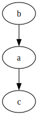
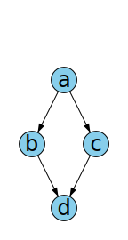
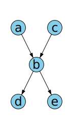

Rust implementation of graph-vis dot from the paper: A Technique for Drawing Directed Graphs

Closely follows the GraphViz algorithm, and produces very similar output in most simple cases.

This was a learning project for me, not an intent to make a rust library for GraphViz.

This is not production quality because:
* It does not produce error types: will panic on any error.
* Does not implement subgraphs, nor most other exotic options
  in dot files.
* Draws straight lines for edges, not splines.
* Runs quite a bit slow, but this could probably be easily fixed
  with some investigation.
  
  Examples:

dot-rs | GraphViz
--- | --- |
 | 
 | 
 | 
 | 
 | 